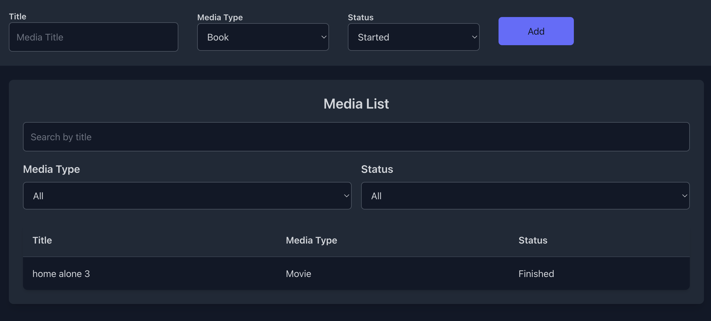

# Media Tracker App 📚🎥🎶

Welcome to the **Media Tracker App**, a web-based application for tracking your reading, watching, and listening habits. This app features a sleek interface, full-width design, and advanced filtering capabilities.  

**⚠️ Work In Progress**: We're actively improving the app with exciting new features, including:
- **User authentication** to enable personalized experiences.
- **Analytics charts** for insights into media consumption habits.
- **Media search database** for exploring and adding new items.

---

## Table of Contents
- [About the Project](#about-the-project)
- [Current Features](#current-features)
- [Future Enhancements](#future-enhancements)
- [Getting Started](#getting-started)
  - [Prerequisites](#prerequisites)
  - [Installation](#installation)
  - [Running the App](#running-the-app)
- [Demo](#demo)
- [License](#license)

---

## About the Project

The **Media Tracker App** simplifies managing your media consumption with a clean and intuitive interface. Users can manually enter details about books, movies, music, podcasts, and TV shows, and easily filter, search, and sort their media. The app is built with **Svelte**, **Tailwind CSS**, and **SQLite** for quick development and smooth performance.

---

## Current Features

- **Manual Entry Form**: Add media details including title, type, status, and more.
- **Media List View**:
  - Full-width design for better readability.
  - Search bar for quick title filtering.
  - Dropdown filters for media type and status.
- **Modern UI**: Styled with Tailwind CSS for a clean and professional look.

---

## Future Enhancements

We're actively working on these features:
1. **User Authentication**: Secure user accounts to store personalized media data.
2. **Analytics Charts**: Gain insights with bar and line charts showing:
   - Media consumption trends.
   - Favorite genres and most active months.
   - Total items completed by type and time spent.
3. **Media Search Database**: Search for and add media directly from a public database.

---

## Getting Started

### Prerequisites

Make sure you have the following installed:
- **Node.js** (v16 or later)
- **npm** (v7 or later)
- **Git**

### Installation

1. Clone the repository:
   ```bash
   git clone https://github.com/your-username/media-tracker-app.git
   cd media-tracker-app
   ```
2. Install dependencies using Poetry for backend management and npm for frontend:
   ```bash
   poetry install
   npm install
   ```
3. Set up the database:
    ```bash
    python manage.py migrate
    ```


### Running the App

1. Start the API:
   ```bash
   cd media_tracker_backend/media_tracker_backend
   poetry run uvicorn main:app --reload

2. Start the development server:
   ```bash
   npm run dev
   ```
3. Open the app in your browser at http://localhost:5173.
4. Begin adding and managing your media!


## Demo



## License

This project is licensed under the **MIT License**. See the `LICENSE` file for more details.
